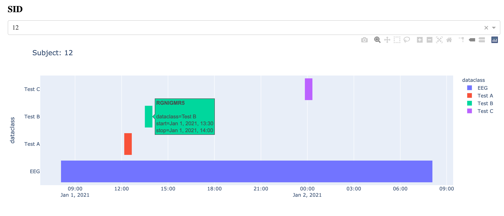

# Data Timeline Dashboard
Generate timeline for data files

## Problem
Client had different types of data across multiple subjects. 
What I had were subject IDs, types of data, and timestamps. 
(Actually timestamps were buried in files, with different formats. Had to write code, not here, to extract these into a table.)
What I was missing was the study design and what part of the study the data belonged. For example, day 0 pre-intervention.

## Solution
Build interactive visualization tool to understand the study design and tag files.
Repo is simple Dash Gannt chart that consumes a table of filenames with start and stop timestamps.
Can be used to visualize what was collected when and relative to other data. 
Can see if data is missing, etc. 
Hover text gives the name of the file, used to manually add session tag.
You can modify this to show multiple subjects (can also launch multiple browsers for this), link click events to other operations (such as adding tag), etc.

